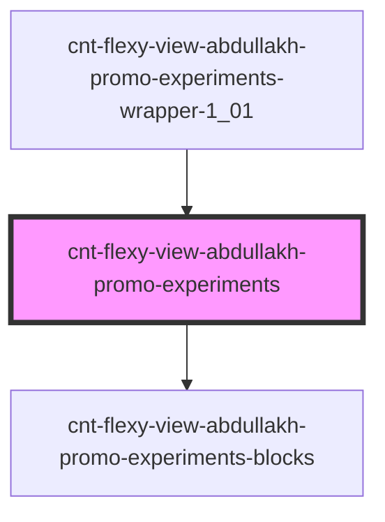

# cnt-flexy-view-abdullakh-promo-experiments

<!-- Auto Generated Below -->

## Properties

| Property  | Attribute | Description                             | Type                   | Default     |
| --------- | --------- | --------------------------------------- | ---------------------- | ----------- |
| `payload` | --        | массив для вывода элементов Experiments | `AbdullakhExperiments` | `undefined` |

## Events

| Event                | Description                                      | Type               |
| -------------------- | ------------------------------------------------ | ------------------ |
| `clickOnExperiments` | клик по элементам компонента TransitionCreateBot | `CustomEvent<any>` |

## Dependencies

### Used by

 - [cnt-flexy-view-abdullakh-promo-experiments-wrapper-1_01](../../..)

### Depends on

- [cnt-flexy-view-abdullakh-promo-experiments-blocks](./res/view/cnt-flexy-view-abdullakh-promo-experiments-blocks)

### Graph

----------------------------------------------

*Built with [StencilJS](https://stenciljs.com/)*
