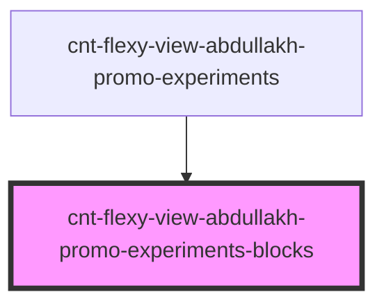

# cnt-flexy-view-abdullakh-promo-experiments-blocks

<!-- Auto Generated Below -->

## Properties

| Property | Attribute | Description                                   | Type                         | Default     |
| -------- | --------- | --------------------------------------------- | ---------------------------- | ----------- |
| `arr`    | --        | массив для вывода элементов ExperimentsBlocks | `AbdullakhExperimentsBlocks` | `undefined` |

## Events

| Event                | Description                                      | Type               |
| -------------------- | ------------------------------------------------ | ------------------ |
| `clickOnExperiments` | клик по элементам компонента TransitionCreateBot | `CustomEvent<any>` |

## Dependencies

### Used by

 - [cnt-flexy-view-abdullakh-promo-experiments](../../..)

### Graph

----------------------------------------------

*Built with [StencilJS](https://stenciljs.com/)*
