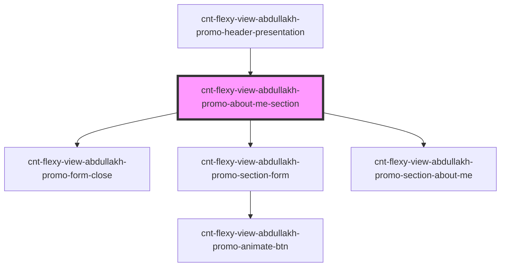

# cnt-flexy-view-abdullakh-promo-about-me-section

<!-- Auto Generated Below -->

## Properties

| Property | Attribute | Description                                        | Type                      | Default     |
| -------- | --------- | -------------------------------------------------- | ------------------------- | ----------- |
| `about`  | --        | объект с массивом меню и string для подкомпонентов | `AbdullakhAboutMeSection` | `undefined` |

## Events

| Event           | Description                  | Type               |
| --------------- | ---------------------------- | ------------------ |
| `clickOnHeader` | клик по элементам компонента | `CustomEvent<any>` |
| `closeForm`     | Вызов модального окна формы  | `CustomEvent<any>` |

## Dependencies

### Used by

 - [cnt-flexy-view-abdullakh-promo-header-presentation](../../..)

### Depends on

- [cnt-flexy-view-abdullakh-promo-form-close](./res/view/cnt-flexy-view-abdullakh-promo-form-close)
- [cnt-flexy-view-abdullakh-promo-section-form](./res/view/cnt-flexy-view-abdullakh-promo-section-form)
- [cnt-flexy-view-abdullakh-promo-section-about-me](./res/view/cnt-flexy-view-abdullakh-promo-section-about-me)

### Graph

----------------------------------------------

*Built with [StencilJS](https://stenciljs.com/)*
