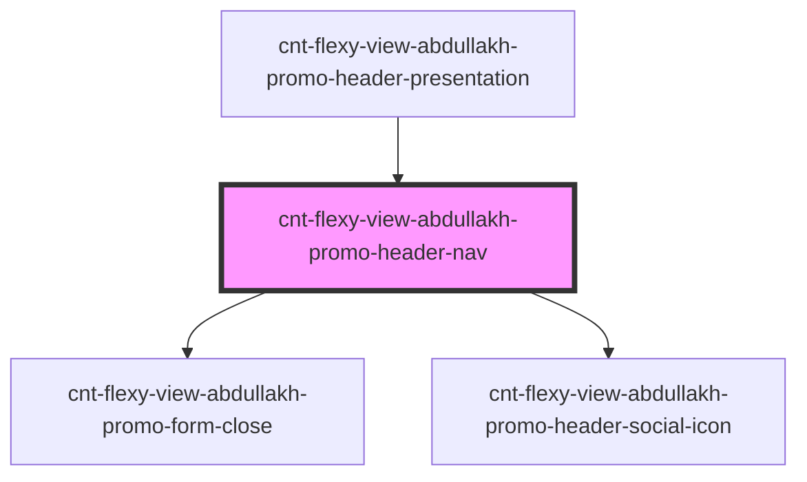

# cnt-flexy-view-abdullakh-header-nav

<!-- Auto Generated Below -->

## Properties

| Property  | Attribute | Description                                        | Type                       | Default     |
| --------- | --------- | -------------------------------------------------- | -------------------------- | ----------- |
| `headNav` | --        | объект с массивом меню и string для подкомпонентов | `AbdullakhHeaderNav`       | `undefined` |
| `social`  | --        | объект с массивом меню и string для подкомпонентов | `AbdullakhHeaderNavSocial` | `undefined` |

## Dependencies

### Used by

 - [cnt-flexy-view-abdullakh-promo-header-presentation](../../..)

### Depends on

- [cnt-flexy-view-abdullakh-promo-form-close](../cnt-flexy-view-abdullakh-promo-about-me-section/res/view/cnt-flexy-view-abdullakh-promo-form-close)
- [cnt-flexy-view-abdullakh-promo-header-social-icon](../cnt-flexy-view-abdullakh-promo-header-social-icon)

### Graph

----------------------------------------------

*Built with [StencilJS](https://stenciljs.com/)*
