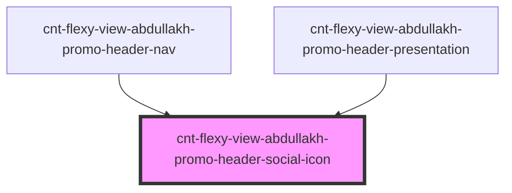

# cnt-flexy-view-abdullakh-promo-header-social-icon

<!-- Auto Generated Below -->

## Properties

| Property | Attribute | Description | Type                       | Default     |
| -------- | --------- | ----------- | -------------------------- | ----------- |
| `icon`   | --        |             | `AbdullakhHeaderNavSocial` | `undefined` |

## Dependencies

### Used by

 - [cnt-flexy-view-abdullakh-promo-header-nav](../cnt-flexy-view-abdullakh-promo-header-nav)
 - [cnt-flexy-view-abdullakh-promo-header-presentation](../../..)

### Graph

----------------------------------------------

*Built with [StencilJS](https://stenciljs.com/)*
